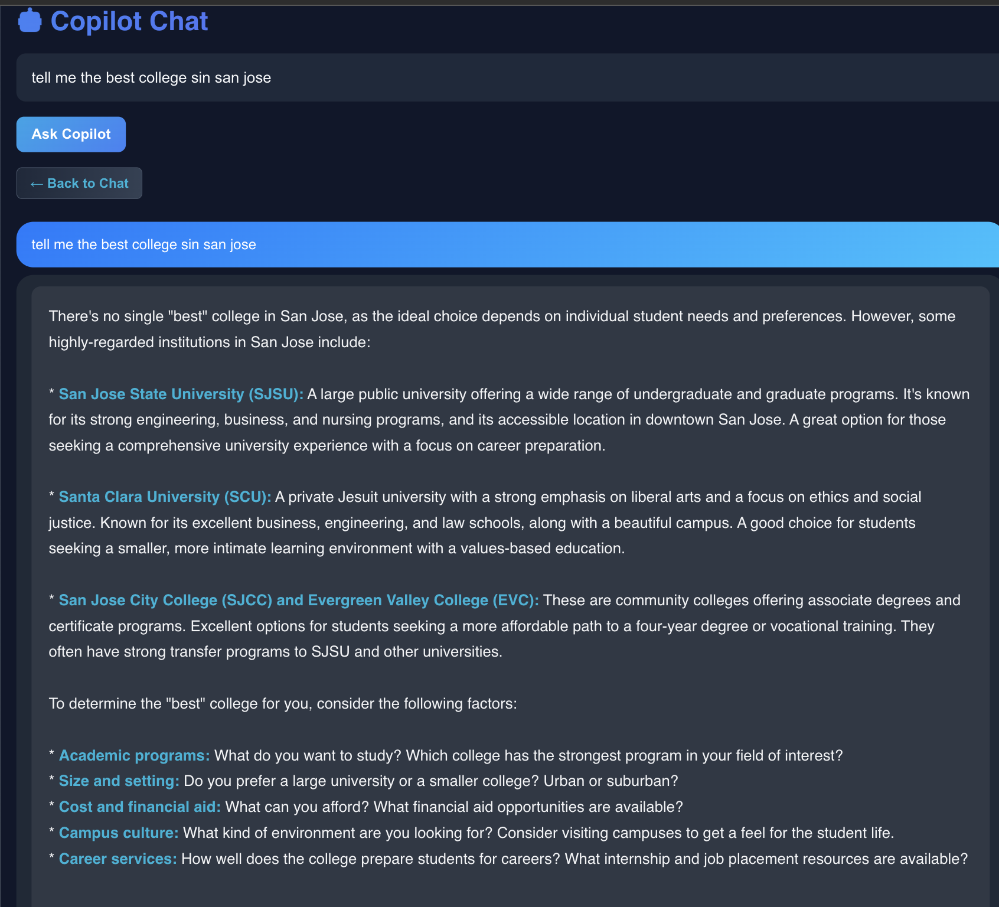
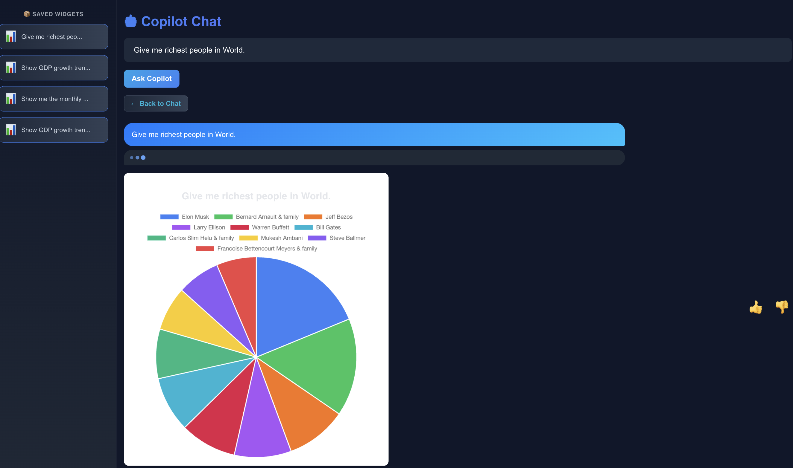
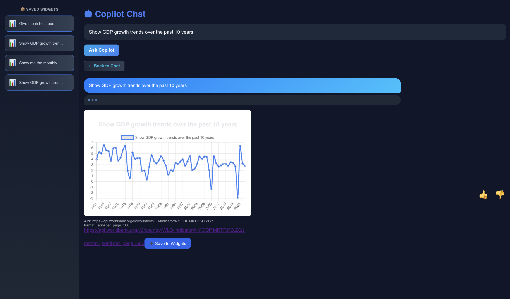

# 🤖 AI Copilot RAG Platform

A robust AI-driven Copilot system combining **multi-agent RAG architecture**, **domain-specific intelligence**, and **real-time data visualization**, built using **React**, **FastAPI**, **LangChain**, and **Gemini API**.

---

## 🧠 System Architecture

> The architecture powers intelligent routing between agents (Clinical, Food Security, WebUI) and retrieves answers from relevant PDF knowledge bases using FAISS and Gemini LLM.

---

## 🔍 Features Overview

### 📌 1. Prompt Routing to Domain-Specific Agents

Automatically classifies prompts and delegates them to specialized agents for focused and relevant responses.

---

### 📈 2. Real-Time Chart Visualizations

Generates interactive **pie**, **line**, and **table** charts based on Gemini's structured output. Supports data prompts across health, agriculture, economy, etc.

---

### 💾 3. Persistent Widgets with API Tracking

Save visualizations as reusable widgets. Each widget includes the chart, title, and API endpoint for future reference.

---

### 💬 4. Clean Chat Interface with Markdown Formatting

Displays Gemini responses with support for headers, bold text, bullet points, and structured formatting for clarity.

---

## 🧪 Extra Feature Snapshot

Minimalistic yet functional UI with responsive design and fast navigation between saved charts and chat history.

---

## 🛠️ Technologies Used

`React.js`, `FastAPI`, `LangChain`, `Gemini API`, `FAISS`, `MQTT`, `Flask`, `Docker`, `Recharts`, `Librosa`

---

## 🏁 Built During

**Spring 2025 CMPE 280 Hackathon**  
San José State University — *Web UI Design and Development*

> “Production-grade implementation with cutting-edge LLM design and polished UI/UX” – Faculty Review
